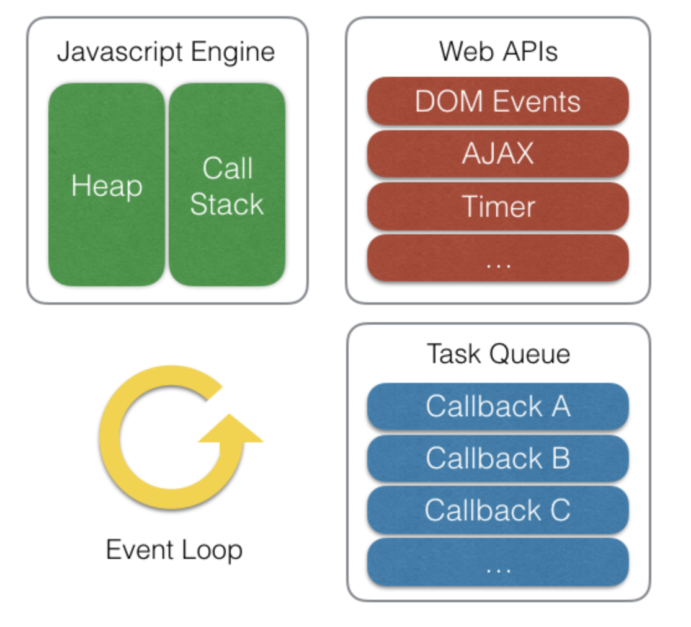
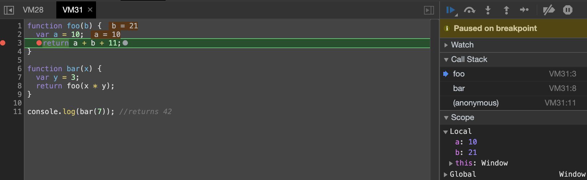

Javascript 는 싱글 스레드(single-thread) 기반 언어이다. 
그럼에도 불구하고 어떻게 동시에 여러 작업을 비동기로 처리할 수 있는 것일까?



## Call stack
Javascript 엔진(e.g., V8 Engine)은 실행 컨택스트 및 원시타입(숫자, 문자열 등)을 저장하는 Call stack, 참조타입(객체, 배열, 함수 등)을 저장하는 Heap 메모리 구조를 가진다.  
하나의 Call stack (단일 호출 스택)만을 사용하기 때문에 싱글 스레드 프로그래밍 언어라고 불린다.  
즉, 모든 작업이 동기적으로 처리되어 하나의 함수가 실행되면 이 함수의 실행이 끝날 때 까지는 다른 작업을 할수 없다.  
  
[Call Stack 작동방식 그림 참조](https://hudi.kr/%EB%B9%84%EB%8F%99%EA%B8%B0%EC%A0%81-javascript-%EC%8B%B1%EA%B8%80%EC%8A%A4%EB%A0%88%EB%93%9C-%EA%B8%B0%EB%B0%98-js%EC%9D%98-%EB%B9%84%EB%8F%99%EA%B8%B0-%EC%B2%98%EB%A6%AC-%EB%B0%A9%EB%B2%95/)


bar, foo 함수가 차례로 호출되어 Call Stack에 쌓인 모습이다.

> 전역 환경에서 실행되는 코드는 한 단위의 코드블록으로써 가상의 익명함수로 감싸져 있다고 생각하는 것이 좋다. 
> 따라서 위의 코드의 첫 줄이 실행될 때에 호출 스택의 맨 아래에 익명 함수가 하나 추가되며, 마지막 라인까지 실행되고 나면 스택에서 제거된다.


## Web API
Javascript 단일 호출 스택이므로 요청이 들어오면 해당 요청을 순차적으로 처리하는 역할만을 하며, 비동기 요청은 Javascript를 구동하는 환경(브라우저, Node.js)이 담당한다.  
브라우저에서 비동기 호출을 위해 사용하는 setTimeout, Ajax(Asynchronous Javascript and XMLHttpRequest), DOM API 등은 Javascript 엔진이 아닌 Web API 영역에 따로 정의되어 있는 것이다.  
Node.js에서는 C++ API가 담당한다.

Javascript에서 setTimeout 함수를 실행하면, Web API에 setTimeout을 요청함과 동시에 Callback 함수까지 전달한다.
이후 setTimeout 작업은 Call Stack에서 제거된다.
 
Web API는 방금 요청받은 setTimeout을 완료한 뒤 함께 전달받은 Callback 함수를 Task Queue 라는 곳에 전달한다.  
또는, 서버에서 데이터를 요청하는 Ajax 작업 이후 응답이 오면 Callback 함수를 Task Queue에 전달한다. 

## Task Queue, Event Loop
Task Queue 는 Queue (First come, First served) 형태의 자료구조를 사용하여 Web API에서 넘겨 받은 Callback 작업들을 보관하는 영역이다.  
이 Callback 함수들은 Javascript 엔진의 Call Stack 영역의 모든 작업이 완료되면 (Call Stack이 비워지면) 순서대로 Call Stack으로 이동한다.  
이때, Call Stack의 상태를 확인하고 Task Queue에 이동할 Task가 존재하는지 판단하여 옮기는 작업을 Event Loop가 담당한다.  

```javscript
while (queue.waitForMessage()) {
    queue.processNextMessage();
} 
```
Event loop를 위와 같은 코드로 나타낼 수 있다.  
__현재 실행중인 태스크가 없는지__와 __태스크 큐에 태스크가 있는지__를 지속적으로 검사하며 전달하는 일을 한다.

```javascript
setTimeout(function() {
    console.log('async');
}, 0);
console.log('sync');

Result:
> sync
> asyn 
```
setTimeout의 설정 시간이 0이라고 해도 Web API, Task Queue에 추가 되기 때문에 Call Stack의 작업들이 모두 완료된 후 실행 되게 된다.  
즉, setTimeout의 두번째 인자로 전달되는 시간은 정확히 그 시간뒤에 실행된다는 의미보다는 __최소지연시간__ 이라는 뜻에 가깝다.   
(크롬에서는 최소 단위로 4ms를 사용하므로 setTimeout(callback, 0)은 setTimeout(callback, 4)와 똑같이 작동한다.)

## Micro Task Queue
```javascript
console.log('script start'); 

setTimeout(function() {
  console.log('setTimeout');
}, 0);

Promise.resolve().then(function() {
  console.log('promise1');
}).then(function() {
  console.log('promise2');
});

console.log('script end');

Result:
> script start
> script end
> promise1
> promise2
> setTimeout
```
script start, script end가 먼저 실행되는 건 당연한데, promise들이 setTimeout보다 먼저 실행 되었다.  
Javascript 실행 환경은 일반 Task Queue(Macro Task Queue)외에 Microtask Queue 라는 큐가 한개 더 존재하며 일반 Task Queue 보다 더 높은 우선순위를 가진다.  
즉, Task Queue와 Microtask Queue 모두에 대기중인 작업이 있더라도 Event Loop는 Microtask Queue의 작업을 먼저 옮겨간다.  
ES6의 Promise가 Mircotask Queue에 저장되는 대표적인 예이다.

Task Queue: setTimeout, setInterval, UI rendering   
Microtask Queue: Promise

브라우저 렌더링 엔진의 태스크는 일반 TasK Queue에 저장되기 때문에 Microtask Queue의 작업들이 너무 오랜시간이 걸린다면 사용자 경험에 큰 불편을 가져다 줄 수 있다.

## Event loop Visualization
http://latentflip.com/loupe  
https://www.jsv9000.app/


## References
- [Must Know About Frontent > Callstack, Heap](https://github.com/baeharam/Must-Know-About-Frontend/blob/master/Notes/javascript/stack-heap.md)
- [Hudi > 비동기적 Javascript – 싱글스레드 기반 JS의 비동기 처리 방법](https://hudi.kr/%EB%B9%84%EB%8F%99%EA%B8%B0%EC%A0%81-javascript-%EC%8B%B1%EA%B8%80%EC%8A%A4%EB%A0%88%EB%93%9C-%EA%B8%B0%EB%B0%98-js%EC%9D%98-%EB%B9%84%EB%8F%99%EA%B8%B0-%EC%B2%98%EB%A6%AC-%EB%B0%A9%EB%B2%95/)
- [Toast Meetup > 자바스크립트와 이벤트 루프](https://meetup.toast.com/posts/89)
- [thms200.log > Event Loop (이벤트 루프)](https://velog.io/@thms200/Event-Loop-%EC%9D%B4%EB%B2%A4%ED%8A%B8-%EB%A3%A8%ED%94%84)
- [jsconf > what the heck is the event loop anyway?](https://2014.jsconf.eu/speakers/philip-roberts-what-the-heck-is-the-event-loop-anyway.html)
- [Huiseoul Engineering > 자바스크립트는 어떻게 작동하는가: 이벤트 루프와 비동기 프로그래밍의 부상, async/await을 이용한 코딩 팁 다섯 가지](https://engineering.huiseoul.com/%EC%9E%90%EB%B0%94%EC%8A%A4%ED%81%AC%EB%A6%BD%ED%8A%B8%EB%8A%94-%EC%96%B4%EB%96%BB%EA%B2%8C-%EC%9E%91%EB%8F%99%ED%95%98%EB%8A%94%EA%B0%80-%EC%9D%B4%EB%B2%A4%ED%8A%B8-%EB%A3%A8%ED%94%84%EC%99%80-%EB%B9%84%EB%8F%99%EA%B8%B0-%ED%94%84%EB%A1%9C%EA%B7%B8%EB%9E%98%EB%B0%8D%EC%9D%98-%EB%B6%80%EC%83%81-async-await%EC%9D%84-%EC%9D%B4%EC%9A%A9%ED%95%9C-%EC%BD%94%EB%94%A9-%ED%8C%81-%EB%8B%A4%EC%84%AF-%EA%B0%80%EC%A7%80-df65ffb4e7e)
- [Jakearchibald > Tasks, microtasks, queues and schedules](https://jakearchibald.com/2015/tasks-microtasks-queues-and-schedules/)