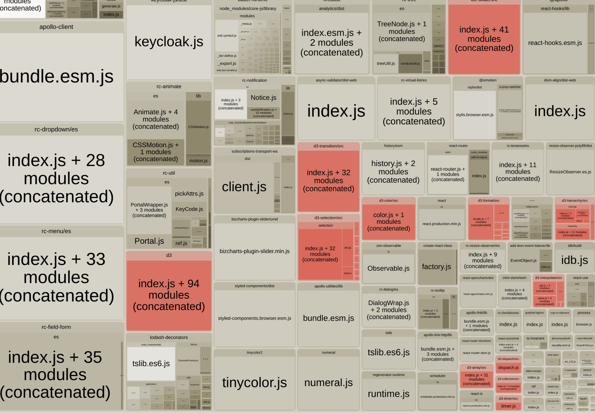
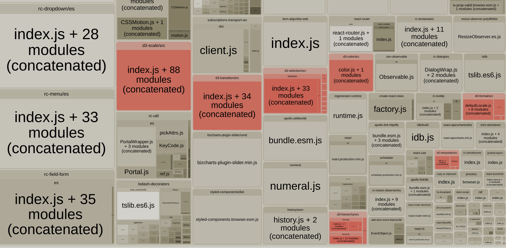

webpack bundle analyzer / source-map-explore

CommonJS는 tree-shaking이 안된다. ES Module에서만 tree-shaking을 할 수 있다.

`import allComponent from "library"` 대신 `import { conponent } from "library"`;
형태로 import 하면 대부분의 라이브러리가 tree-shaking이 된다.

- antd 

build 하면 tree-shaking 이 되어서 import 되어있다. 대부분의 컴포넌트가 es 폴더에서 import 되어있다.es6+ 문법으로 작성한 것으로 보인다.

babel-plugin-import 를 사용하면 lib 폴더의 컴포넌트를 import 하게 된다.

- lodash

`import { sortBy } from "lodash"` 로 import 해주어도 tree-shaking이 잘 안된다.

이는 lodash에서 각 요소들을 commonJS 형태로 export 하고 있기 때문이다.

`babel-plugin-lodash` 를 설치해야한다.

- d3
`import * as d3 from 'd3'` 는 모든 d3 모듈을 다 불러온다.

`import { foramt } from 'd3-format`을 사용하면 사용되는 모듈만을 불러온다.

[`babel-plugin-transform-d3-imports`](https://www.npmjs.com/package/babel-plugin-transform-d3-imports) 
d3의 각 모듈에서도 내부 폴더까지 cherry-picking 해주는 babel-plugin을 사용하면 여기서 더 줄일 수 있을것 같지만
사용한 결과 크기상에 변화가 거의없다 30KB 정도. (3.4MB -> 3.37MB)

https://huns.me/development/2265
https://webpack.js.org/configuration/optimization/#optimizationsideeffects
https://dev.to/lukasbombach/how-to-write-a-tree-shakable-component-library-4ied
https://github.com/ant-design/babel-plugin-import
https://developers.google.com/web/fundamentals/performance/optimizing-javascript/tree-shaking
https://ui.toast.com/weekly-pick/ko_20180716/
